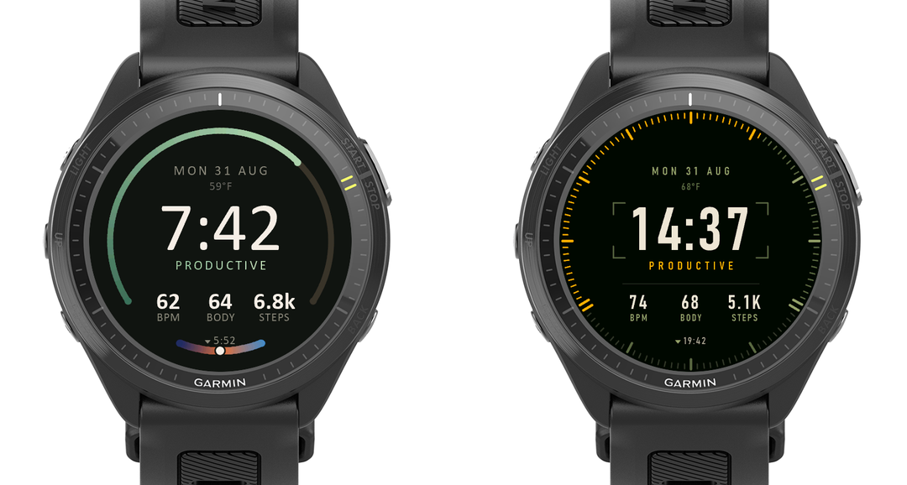
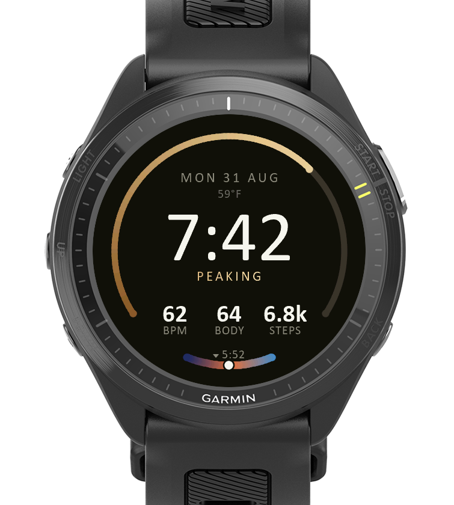
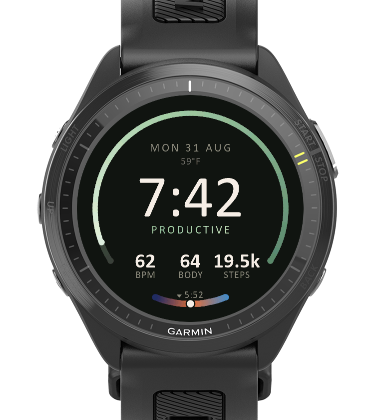
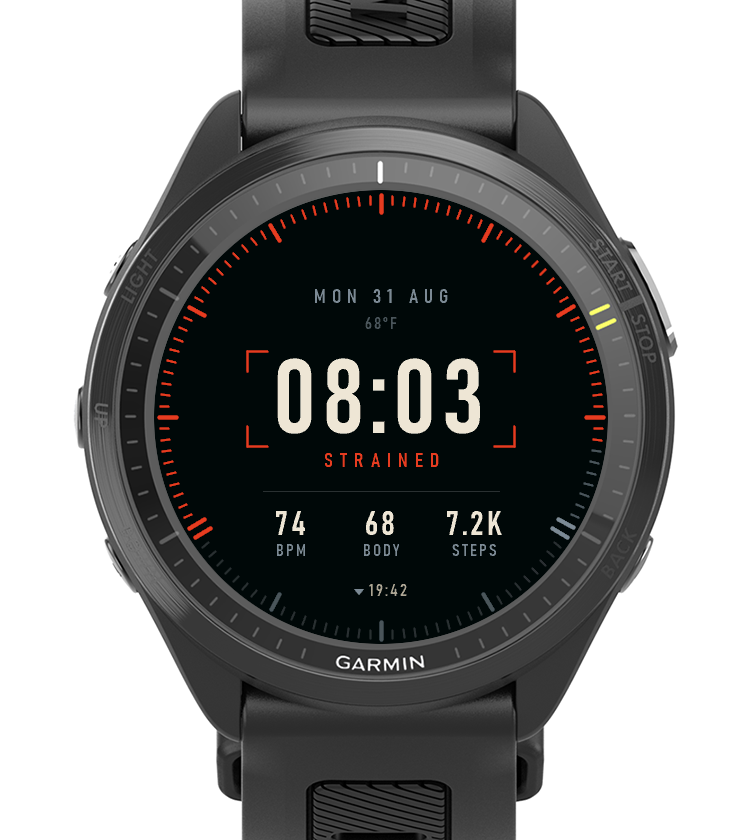
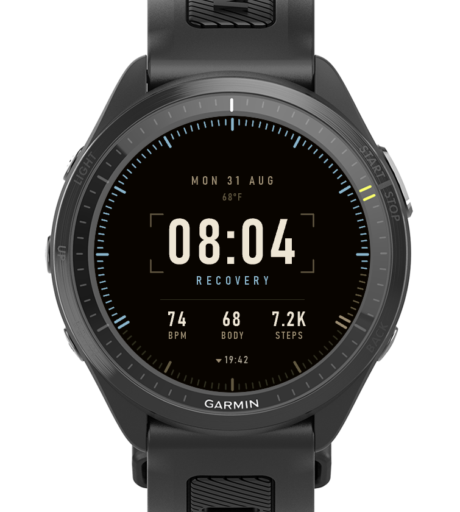

# Garmin watch faces

Two Connect IQ watch faces for the **Forerunner 970** (454x454 round AMOLED,
burn-in protected), built on a shared architecture and pushed in opposite
design directions.



Both read the same things off the watch - steps against goal, heart rate, body
battery, training status, sunrise/sunset, temperature - and both spend their
whole design budget on one question: what can you learn from this face without
reading it?

| | [**Clay**](clay/) | [**Recon**](recon/) |
|---|---|---|
| Voice | editorial, warm, typographic | instrument panel, issued equipment |
| Typeface | Calibri / Palatino | Bahnschrift (DIN 1451), tabular figures |
| Step gauge | one arc, rounded caps, four-stop gradient | 120 square-ended graduations |
| Palette | nine training-status accent ramps | three signals, three structure families |
| Clock | follows the device 12/24 setting | always 24-hour, zero-padded |
| Layouts | four, switchable | one |

---

## Clay

A near-black disc with two gauges and one page of type. The big ring is the
day's step goal; the short dial at six o'clock is the sky between now and the
next sunrise or sunset. Training status is carried by colour, and by the one
word that explains it.

<p float="left">
  
  
  
</p>

Nine training statuses, nine accent ramps. Past 100% the ring drops to a ghost
of the finished lap and starts again from the far end running backward, lit
hotter, so 160% is a visibly different picture from 60%.

[Full documentation](clay/README.md) | [all states](clay/screenshots/_gallery.png)

---

## Recon

The same composition rebuilt out of hard edges. The arc becomes a *scale* -
120 graduations at 3°, majors every 30, square ends - because a gradient says
"somewhere around here" and a graduation says a number.

<p float="left">
  
  
  
</p>

Nine statuses collapse to three signals - amber nominal, steel standby, red
warning - each paired with a structure family chosen to oppose its temperature.
Only the warning escalates: strained is the one day the centre of the face
changes colour.

[Full documentation](recon/README.md) | [all states](recon/screenshots/_gallery.png)

---

## Install

No build required - grab `Clay.prg` and/or `Recon.prg` from the
[latest release](../../releases/latest).

1. Connect the watch by USB. It mounts as an **MTP device** (a "portable
   device" in Explorer), not a drive letter.
2. Copy the `.prg` into `Internal Storage/GARMIN/Apps/`.
3. Eject properly, then unplug. The watch indexes the app on disconnect.
4. Long-press **UP** from the watch face > watch-face list > pick it.

On Windows there is a script that handles the MTP quirks, once the `.prg` is in
the face's `bin/` folder:

```
powershell -ExecutionPolicy Bypass -File tools\install.ps1 -App Recon
```

Two things that will otherwise waste an afternoon:

- **MTP does not reliably overwrite.** Copying a new `.prg` over an existing
  one can silently do nothing, or hang on a replace dialog. If a `.prg` is
  already sitting in `Apps/`, unplug first and let the watch consume it - an
  empty `Apps/` folder is what a successful install looks like.
- **Settings survive reinstalls.** The watch keeps `Apps/SETTINGS/<App>.SET`,
  and a value stored there wins over any new default compiled in. If a new
  build behaves as though it ignored a `properties.xml` change, delete that
  file. A sideloaded build has no settings UI on the watch to fix it from.

## Build from source

Needs the Connect IQ SDK and **your own developer key** - no key is included
here, and none should be.

```
openssl genrsa -out developer_key.pem 4096
openssl pkcs8 -topk8 -inform PEM -outform DER \
  -in developer_key.pem -out developer_key.der -nocrypt
```

Then, from `clay/` or `recon/`:

```
SDK=<your connectiq-sdk path>
"$SDK/bin/monkeyc.bat" -o bin/Recon.prg -f monkey.jungle \
  -y <your developer_key.der> -d fr970 -w
"$SDK/bin/connectiq.bat"                       # simulator
"$SDK/bin/monkeydo.bat" bin/Recon.prg fr970
```

The `manifest.xml` files carry app UUIDs that are already claimed. Fine for
sideloading onto your own watch; generate new ones if you intend to publish,
since two apps cannot share an ID in the store.

## Repository layout

```
clay/          the editorial face - four layouts, nine accent ramps
recon/         the instrument face - graduated bezel, three signals
tools/         install.ps1, shared MTP sideloader
screenshots/   hero image; per-face sets live under each face
```

Each face carries its own font generator under `tools/`, which subsets a system
typeface into a Connect IQ bitmap font - the sheets in `resources/fonts/` are
generated, not hand-built.

## Licence

MIT - see [LICENSE](LICENSE).
