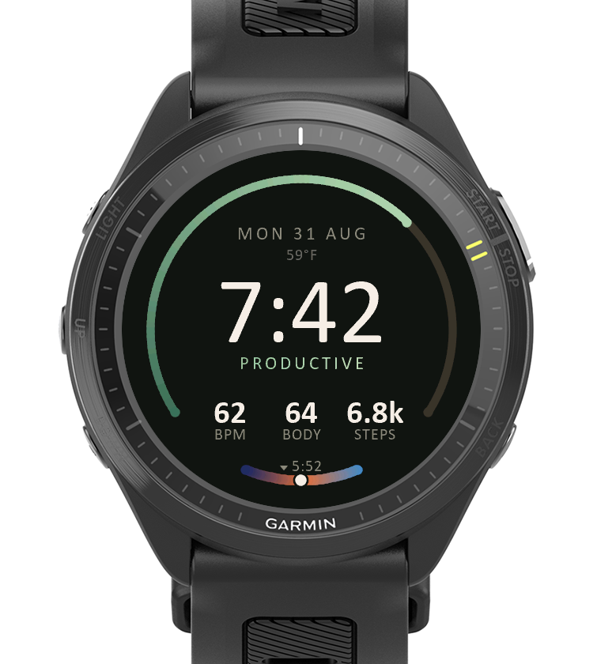
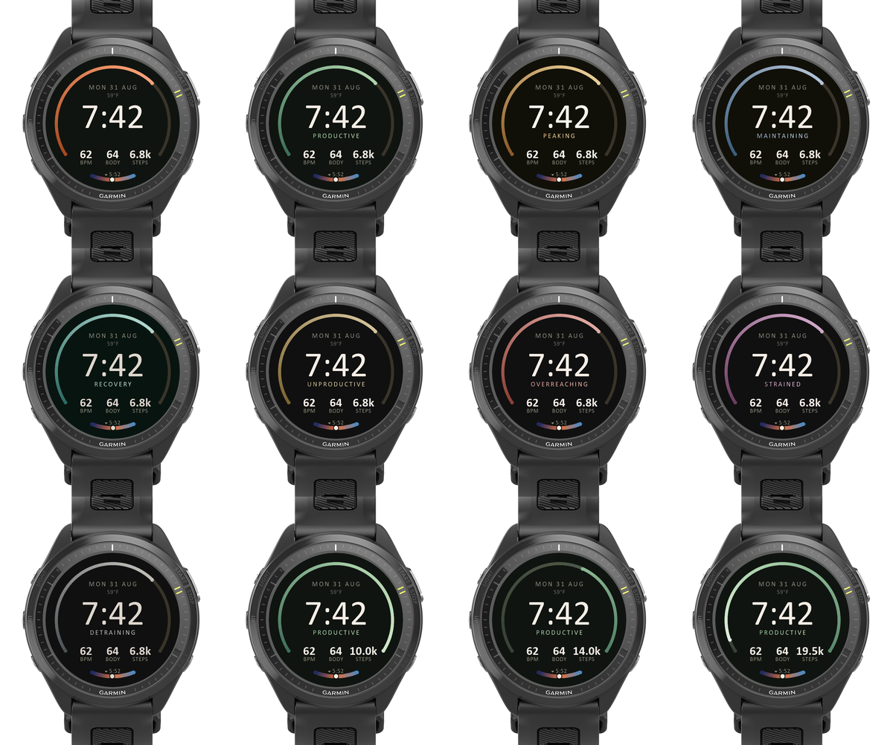

# Clay - a Garmin Connect IQ watch face

Built for the **Forerunner 970** (454x454 round AMOLED, burn-in protected).

A near-black disc with two gauges and one page of type. The big ring is the
day's step goal; the short dial at six o'clock is the sky between now and the
next sunrise or sunset. Training status is carried by colour, and by the one
word that explains it.



---

## Install it (no build required)

Grab `Clay.prg` from the [latest release](../../../releases/latest) -
prebuilt and signed, ready to sideload. Drop it in `bin/` if you want to
use the installer script below.

1. Connect the watch by USB. It mounts as an **MTP device** (a "portable
   device" in Explorer), not a drive letter.
2. Copy `Clay.prg` into `Internal Storage/GARMIN/Apps/`. On Windows,
   `powershell -ExecutionPolicy Bypass -File ..\tools\install.ps1 -App Clay`
   handles the MTP quirks below for you.
3. Eject properly, then unplug. The watch indexes the app on disconnect.
4. Long-press **UP** from the watch face > the watch-face list > pick Clay.

Two things that will otherwise waste your afternoon:

- **MTP does not reliably overwrite.** Copying a new `Clay.prg` over an
  existing one can silently do nothing, or hang on a replace dialog. If a
  `.prg` is already sitting in `Apps/`, unplug first and let the watch consume
  it - an empty `Apps/` folder is what a successful install looks like.
- **Settings survive reinstalls.** The watch keeps `Apps/SETTINGS/Clay.SET`,
  and a value stored there wins over any new default you compile in. If a new
  build behaves as though it ignored your `properties.xml` change, delete that
  file.

---

## What the face shows

| Element | Source |
|---|---|
| Big ring | Steps against the day's step goal |
| Short dial at six | Time until the next sunrise/sunset, painted as the sky |
| Ring + status word colour | Training status complication |
| Centre | Time |
| Under the date | Temperature |
| Footer row | Heart rate | body battery | steps |

### The ring past 100%

Reaching the goal doesn't end the ring. At 100% it drops to a ghost of the
finished lap and starts again **from the far end, running backward**, lit
hotter - so 160% is a visibly different picture from 60%, which a bar that
simply tops out cannot manage. Past 200% it holds.

Overpainting the finished lap was tried first and fails: a full arc getting
slightly brighter has no moving boundary, so nothing reads as motion. The
second pass needs a leading edge of its own.

### The sun dial

Through the day it runs sky > sunset > night; through the night the same three
stops backwards. Cloudiness mixes each daylight stop toward its overcast
version. Garmin publishes no cloud percentage, only a condition enum, so
`Metrics.cloudFrom` buckets that into 0.0-1.0, and no weather at all reads as
clear rather than overcast.

---

## Build from source

```
SDK=<your connectiq-sdk path>
"$SDK/bin/monkeyc.bat" -o bin/Clay.prg -f monkey.jungle \
  -y <your developer_key.der> -d fr970 -r -w
"$SDK/bin/connectiq.bat"                     # simulator
"$SDK/bin/monkeydo.bat" bin/Clay.prg fr970
```

**Generate your own developer key and UUID if you intend to publish.** The
`manifest.xml` here carries an app UUID that is already claimed; it is fine for
sideloading onto your own watch, but two apps cannot share an ID in the store.
Back the key up somewhere permanent - lose it and you can never ship an update
to a published listing.

### Layouts

`resources/settings/properties.xml` carries `layout`: **0 = Radial** (this
one), 1 = Meridian, 2 = Column, 3 = Rings. A sideloaded build has no settings
UI on the watch, so change the default and rebuild to reach the others.

`demoStatus` (1-8) and `demoSteps` (percent of goal) preview states in the
simulator. **Both must ship at 0.**

### Fonts

`tools/make_serif_font.py` subsets a system typeface into a Connect IQ bitmap
font. The sans family the Radial layout uses:

```
python tools/make_serif_font.py --font C:\Windows\Fonts\calibri.ttf  --size 120 --name sans_time  --glyphs time
python tools/make_serif_font.py --font C:\Windows\Fonts\calibrib.ttf --size 41  --name sans_small --glyphs figures
python tools/make_serif_font.py --font C:\Windows\Fonts\calibri.ttf  --size 23  --name sans_label --glyphs label
python tools/make_serif_font.py --font C:\Windows\Fonts\calibri.ttf  --size 20  --name sans_micro --glyphs label
```

Three things that cost real time to learn:

- **The glyph sets are subsets, and a missing glyph renders as a tofu box, not
  as nothing.** The `k` in an abbreviated step count shipped as a box once.
- **Check any candidate typeface for lining figures.** Candara Light looked
  right in a specimen but has old-style figures - the 7 descends, 3 and 0 sit
  at x-height - which is unusable for a clock.
- **Pixel sizes are per-typeface.** Re-solve them from cap heights when
  swapping a face; the px that hits a given cap is not transferable, and it is
  not transferable between weights of the same family either.

---

## Notes for anyone modifying it

- **Garmin measures arc degrees counter-clockwise from 3 o'clock**, and
  `drawArc` takes **whole degrees only**. That is why gradients here are built
  from many flat sub-arcs, and why the sun dial is stamped from overlapping
  discs instead: one degree is a visibly stepping 3px band at this radius.
- **`drawArc` paints a complete circle when start and end land on the same
  degree.** A sweep too small to survive truncation will throw a ring across
  the whole face. `Renderer.arc` guards this.
- **`SensorHistory` queries: never ask for `:period => 1`.** That requests
  exactly one sample, and when it is empty - routine on a real watch - the
  iterator returns valid and yields nothing. Use a window and walk to the first
  sample carrying data. Heart rate has the milder version: the newest entries
  are often `INVALID_HR_SAMPLE`.
- **`Activity.getActivityInfo().currentHeartRate` is null for a watch face**
  outside an activity, so history is the only path that matters on the wrist.
- The awake frame costs roughly 78ms in the simulator, which is not device
  timing. Both gradients run coarse during the wrist-raise reveal so the
  animation does not pay for them.

## Layout gallery

Every training state, the goal overshoot and the always-on face:



The sibling face, [Recon](../recon/), is this same composition rebuilt as
an instrument panel - the arc becomes a graduated scale and the nine
accent ramps collapse to three signals.
