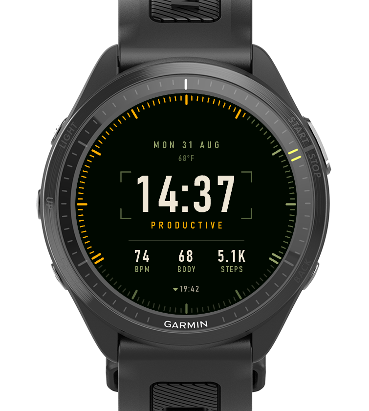
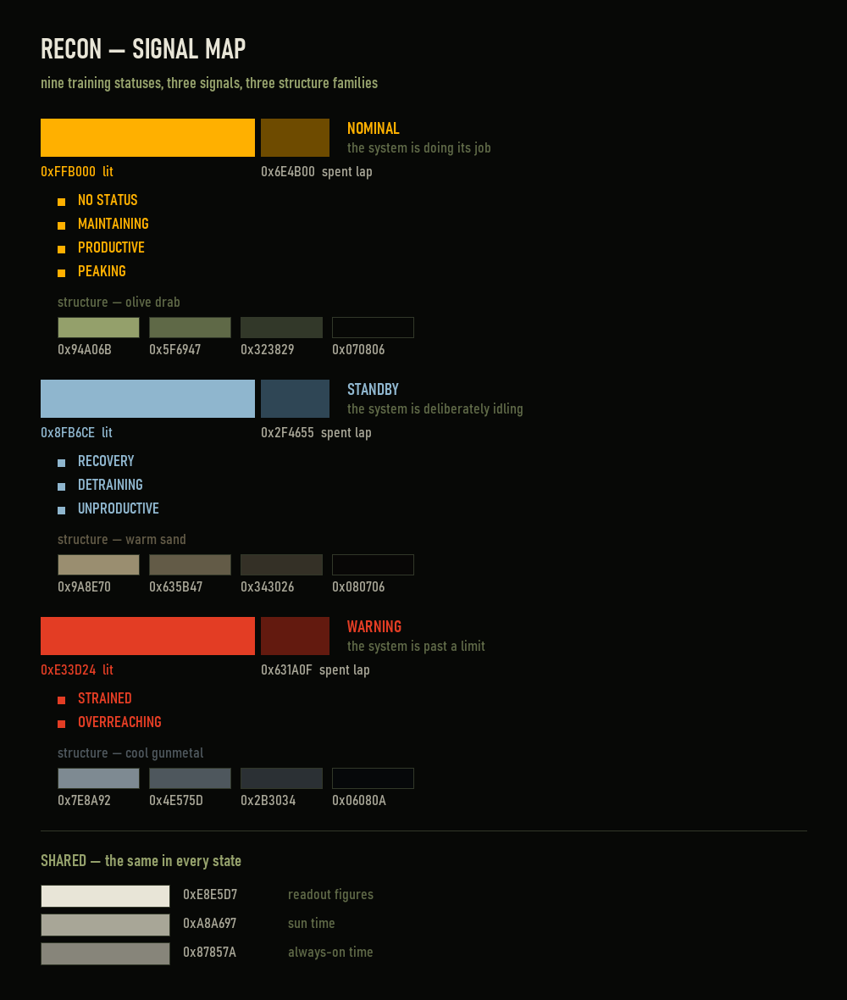

# Recon

A Garmin Connect IQ watch face for the Forerunner 970.



Same information as [Clay](../clay/) - the editorial face in this repo -
rebuilt as an instrument panel. Clay is referenced throughout below as the
thing this was designed against.

Recon is a separate app with its own UUID, not a fifth layout inside
Clay. That was deliberate: a sideloaded build gets no settings UI on the
watch, so a layout index would mean editing `properties.xml` and
reinstalling every time you wanted to swap faces. As two apps both live
on the watch at once and you switch from the Garmin menu.

## What it took from Clay, and what it did not

**Kept, unchanged:** the composition. Every baseline in `BezelFace.mc` is
Clay's, and Clay's were measured off an approved comp rather than chosen
- date, temperature under it as a subtitle, the time large and centred,
the status word, a three-up row of body figures on one shared pair of
baselines, and the next sun event at six o'clock. The comp's argument is
the air between the elements and that air is the first thing a guessed
fraction loses.

**Kept, unchanged:** the step overshoot. At 100% the lit graduations drop
to a spent version of the signal and a second pass starts from the far
end running backward at full brightness, so 160% is a visibly different
picture from 60%. There is no third pass. It is the one thing on Clay
that encodes something a bar cannot.

**Replaced:**

| | Clay | Recon |
|---|---|---|
| Typeface | Calibri (soft humanist) | Bahnschrift / DIN 1451 SemiBold Condensed |
| Figures | proportional | **tabular** - the clock does not reshuffle |
| Clock | follows the device 12/24 setting | always 24-hour, always zero-padded |
| Step gauge | one arc, rounded caps, 4-stop gradient | 120 square-ended graduations, flat fill |
| Sun | a dial painted as the sky, dot-stamped | the time it happens, printed |
| Palette | nine warm accent ramps | three signals, each with its own structure family |
| Furniture | none | corner reticle round the clock, one hairline |

## The three signals

Nine training statuses collapse onto three, which is how a status board
reads:

| Signal | Statuses | Structure paired with it |
|---|---|---|
| **NOMINAL** amber | peaking, productive, maintaining, no status | olive drab |
| **STANDBY** steel | recovery, detraining, unproductive | warm sand |
| **WARNING** red | strained, overreaching | cool gunmetal |

**Structure opposes the signal's temperature.** A warm signal gets cool
structure, a cool signal gets warm structure. One olive served all three
at first and it does not work: olive against red is the bad case - both
are mid-chroma colours a short way apart on the wheel, so a warning day
came out looking dirty rather than urgent, which is the one state that
has to read cleanly. The rule buys two things at once, because structure
that opposes the signal also can never be mistaken for it.

Three families, not nine. Nine statuses already collapse to three
signals; giving strained and overreaching different structure would make
two states that show the same red look like different states for no
reason, and would rebuild the nine-way palette this face deleted.

Unproductive sits in standby, not warning: it means the load is not
paying off, which is a reason to change what you are doing. Strained and
overreaching mean the body is past what it can absorb. Only that pair
earns red, or red stops meaning anything.

This cannot tell peaking from productive by colour. It is not meant to -
the status word under the time says which one it is. Colour is reserved
for the question you need answered without reading: whether anything is
wrong.

No-status resolves to NOMINAL. It is the state the watch sits in until it
has training history, and the most-seen state must not look like a fault.

## Where colour is allowed

Colour extends to **structure**, never to **values**.

The SIGNAL lives in exactly three places: the lit graduations, the status
word, and the reticle around the clock. The reticle qualifies because it
frames a value without being one, so it cannot be misread as a claim
about the time inside it.

STRUCTURE - the graduations, rules, labels, date, temperature, sun mark
and the ground - shifts family with the signal, but it is still
structure: it never encodes a reading, which is why it can change wholesale
without adding meaning.

The row FIGURES and the TIME are excluded from both. They stay bone in
every state. A bone `74` that turns amber is saying something about *that
number* - and once the face can say that, red means both "your training
is past a limit" and "this reading is past a limit", and it answers
neither. Do not add per-metric threshold colours for the same reason.

**Only the warning escalates.** The reticle carries its family's mid
structure tone on all seven ordinary states and goes full `WARN` on
strained and overreaching - the one element that jumps from structure to
signal. Making it a signal tint on every state was the other candidate
and is worse: it would spend the escalation to say "nothing is
happening", leaving the warning nowhere left to go. As built, a strained
day is the only day the centre of the face changes colour, which is the
entire job of having a warning state. Compare `01-nominal-64pct` against
`03-warning-strained`.

**A signal must separate from the structure by HUE, not by a shade of the
structure's own hue.** STANDBY was a pale olive (`0x9FAA7C`) first, one
step up from `OD_LIT` (`0x94A06B`) - the colour of the major graduations
and the labels. Those read as the same colour, so in all three standby
states the lit run and the unlit remainder became indistinguishable and
the gauge stopped reading at all. Steel also agrees with what Clay meant
by these states: it ran teal for recovery and cold steel for detraining.

## Seeing the palette

```
python tools/signal_map.py       # -> screenshots/signal-map.png
```



Every colour the face can show, which status raises it, and its hex. The
values are **parsed out of `source/Theme.mc`**, so the sheet cannot drift
from the face - a palette reference that keeps its own copy of the
numbers is wrong the first time anyone edits the theme, which is exactly
when you go looking at it.

`screenshots/` also holds one capture per visually distinct state. There are
only three, because nine statuses collapse to three signals - rendering
all nine would produce six duplicates:

| | |
|---|---|
| `01-nominal-64pct` | amber, first lap |
| `02-overshoot-160pct` | spent lap dim, second pass bright |
| `03-warning-strained` | red on cool gunmetal structure - gauge, word AND reticle |
| `06-standby-recovery` | steel on warm sand structure |
| `04-no-data` | real reading of zero - endstop lit |
| `05-no-step-goal` | nothing to read - no graduation lit |
| `07-always-on` | burn-in-safe ambient state, time only |

`screenshots/` has the same states composited into the FR970 body, for
anywhere the face needs to be shown as a product rather than as a screen.
Regenerate the whole set with the preview profiles in `tools/` (see the
simulator caveat above - the states have to be injected, not configured).

## Drawing cost

The bezel is 120 `drawLine` calls. Clay's equivalent was a 123-segment
gradient plus ~147 `fillCircle` for the sky dial, and `fillCircle` is the
expensive one - that dial alone was about two thirds of Clay's frame.

Peak memory is **16.4 kB of the 123.9 kB budget (13%)**, measured with
`System.getSystemStats()` in the worst case - strained, 160% of goal, all
four font sheets loaded. Clay peaked at 25.4 kB.

Measured in the simulator at 160% of goal, which is the worst case
(spent lap plus live second pass): **15-16ms**, occasionally 31. Windows'
`System.getTimer()` only ticks every ~15.6ms so readings land on
multiples of it and the true figure sits somewhere inside 8-25ms; Clay's
settled frame at the same load was ~78ms. Simulator timing is not device
timing, but the ratio is real, and nothing here runs coarse during the
wrist-raise reveal because it does not need to.

## Fonts

All four sheets are Bahnschrift - Windows' cut of DIN 1451, the German
industrial standard face off road signs and equipment panels. It is a
variable font with Weight 300-700 and Width 75-100, so weight and
condensation are dialled rather than picked from shipped cuts.

```
python tools/make_din_font.py --name din_time  --size 104 --weight 600 --width 75 --glyphs time    --tabular --tracking 4
python tools/make_din_font.py --name din_small --size 34  --weight 600 --width 75 --glyphs figures --tabular --tracking 2
python tools/make_din_font.py --name din_label --size 20  --weight 500 --width 78 --glyphs label
python tools/make_din_font.py --name din_micro --size 17  --weight 500 --width 78 --glyphs label
```

Sizes are the cap heights carried over from Clay's comp - 76 on the time,
24 on the row figures, 14 and 12 on the words - **re-solved for this
typeface**. The px that hits a given cap is per-face and never transfers,
so re-solve all four when swapping a face.

Two traps worth remembering:

- **Check any candidate for lining figures.** Bahnschrift passes: all ten
  digits share one top and one bottom, give or take 1px of overshoot on
  the round ones. Candara was rejected for Clay because its `7` descends.
- **Subsets render a missing glyph as a tofu box, not as nothing.** The
  sets are upper case only - nothing on this face is set in lower case.
  The `figures` set carries the upper-case `K` that abbreviates steps.

## Build and run

You need the Connect IQ SDK and **your own developer key** - the one this
was built with is not in the repo and never should be. Generate one with
`openssl genrsa -out developer_key.pem 4096` then
`openssl pkcs8 -topk8 -inform PEM -outform DER -in developer_key.pem
-out developer_key.der -nocrypt`, and point `-y` at the `.der`.

If you only want the face on your watch, grab `Recon.prg` from the
[latest release](../../../releases/latest) and skip to *Sideloading*.

```
SDK=~/AppData/Roaming/Garmin/ConnectIQ/Sdks/connectiq-sdk-win-9.2.0-2026-06-09-92a1605b2
"$SDK/bin/monkeyc.bat" -o bin/Recon.prg -f monkey.jungle \
  -y ~/.garmin_keys/developer_key.der -d fr970 -w
"$SDK/bin/connectiq.bat" &                    # simulator GUI, launch once
"$SDK/bin/monkeydo.bat" bin/Recon.prg fr970   # background it; ~20s to paint
```

Four `Statement is not reachable` warnings in `Metrics.mc` are expected
and correct - the compiler knows `ActivityMonitor.getInfo()` and
`getBodyBatteryHistory()` are non-null; the guards stay.

Screenshot the simulator with `PrintWindow(hwnd, hdc, 2)`, never
`CopyFromScreen`. In a 771x922 window the 454x454 screen sits at
(163, 242), so the crop is device space 1:1.

**The simulator reports no steps and no training status**, so the lit
graduations, the signal colour and the second pass cannot be seen from a
stock run. `demoStatus` / `demoSteps` in `properties.xml` do not help:
the simulator persists app settings per UUID, so changing a default and
rebuilding does not reach it. Assign the values at the end of
`Metrics.refresh()`, build, shoot, then revert. The properties still work
on a real install and through the simulator's own settings UI.

## Metrics

`Metrics.mc` is Clay's, cut down to what this face actually reads. Clay
serves four layouts that between them want calories, notifications,
phone state, watch battery, the recovery clock and a cloudiness bucket
for the sky dial. Recon draws none of that, and a reader that runs on
every frame to fill a field nobody paints is bytecode and battery spent
on nothing.

The sensor-history rules carried over intact and matter on the wrist:
never ask for `:period => 1` (one sample, and when it is empty the
iterator returns valid and yields nothing), and walk deep on heart rate
because the newest history entries are routinely `INVALID_HR_SAMPLE`.
